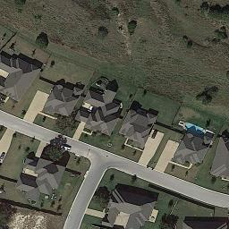
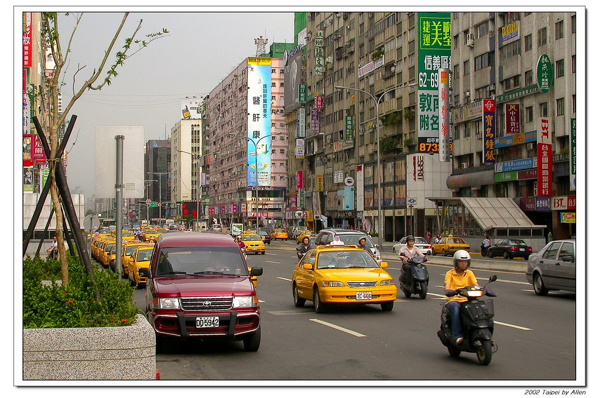
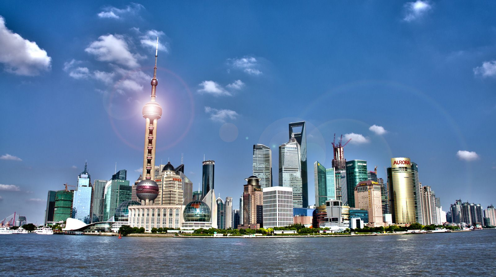
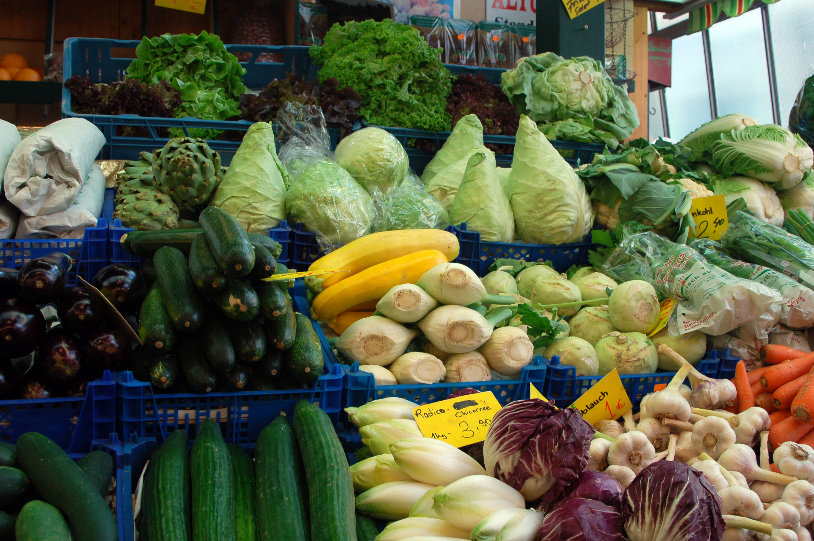
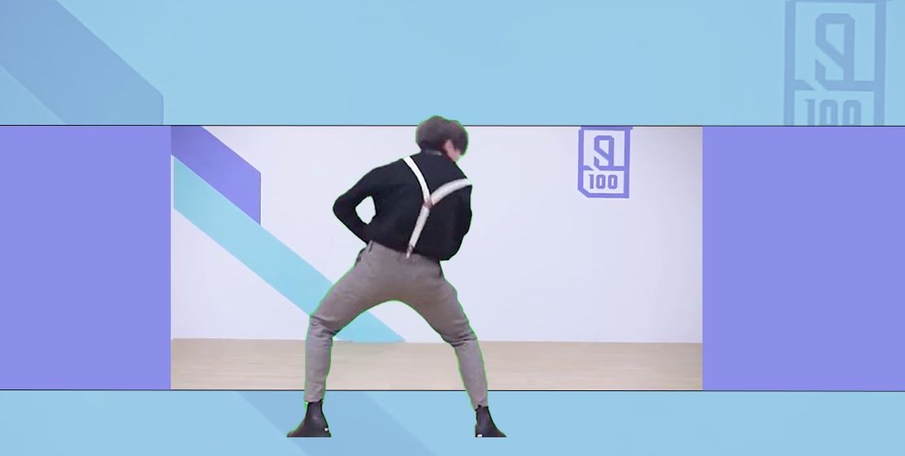
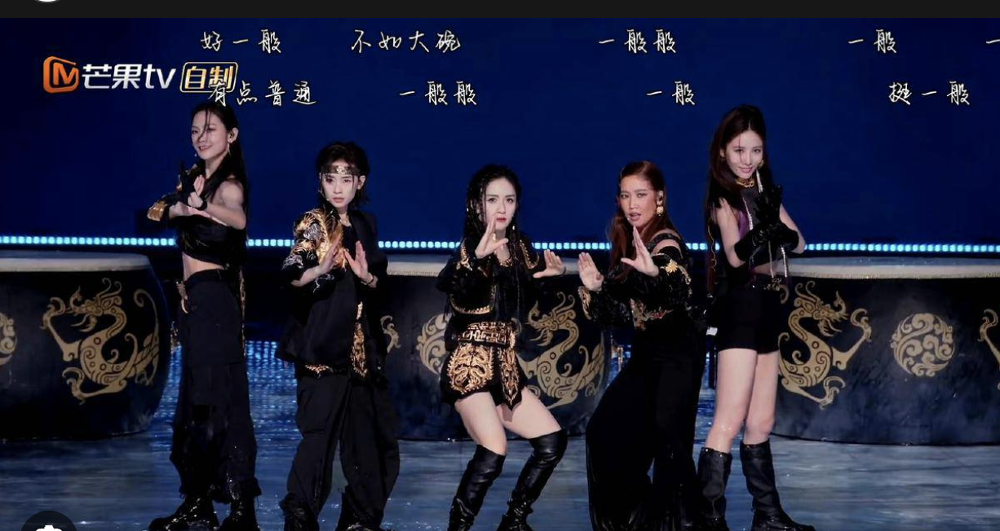

  

>Q：描述下这个图像
>
>A_VisualGLM:蒙娜丽莎的微笑，是永恒的艺术经典。她微笑时，仿佛在讲述一个美丽的故事，让人沉醉其中。她的眼神似乎有着一种神秘的力量，能够吸引人们的目光，让人们无法抗拒她的魔力。她的笑容如此迷人，令人心醉神迷，就像一幅艺术品一样，永远难以忘记。
>A_InstructBLIP(w/ translate):是莱昂纳多达芬奇的名画《蒙娜丽莎》的肖像,也被称为蒙娜莉莎或拉莉莎康达。这幅肖像被人们认为是丽莎 ·德尔 ·巴巴康多,是弗朗西斯科 ·达 ·芬奇在1503-1517年左右创作的,这幅画被认为是世界上最著名的艺术作品之一,它以其神秘的微笑而闻名。
>A_InstructBLIP(w/o translate):是什么作品？ the mona lisa by leonardo da vinci 1503 1517 oil on panel 81 x 65 cm louvre, paris

>Q：这张图像的作者还有其他作品吗？
>
>A_VisualGLM:这幅图片是一张由著名艺术家拉斐尔·米开朗基罗创作的蒙娜丽莎，它以其独特的微笑和优美的线条而闻名于世。这幅画作描绘了一个神秘、优雅和迷人的女性形象，她似乎正在沉思或思考着什么，展现出一种独特的美感。
>A_IBLIP(w/ t):《蒙娜丽莎》雷昂纳多 ·达芬奇

>Q：详细描述下这个图像
>
>A_VisualGLM:这是一张俯瞰住宅区的航拍照片，住宅区位于一条弯曲的道路上，周围有树木和草地环绕。房屋排成一排，呈扇形排列在道路两侧。屋顶为白色，窗户上安装着玻璃，并配有红色或金色的门把手。天空晴朗无云，阳光透过树叶洒落在地上。
>A_InstructBLIP(w/ t):3D视图,一个有房子的住宅区,在前景中有一条街道,被绿草和树木包围。这个鸟瞰图拍摄了一个有房子和街道的住宅区域,在前台,被绿色的草地和树林包围着。这些房子看起来很安稳,位于一个宁静的街区。这张照片提供了一个鸟瞰的视角,可以全面地了解街区的布局和整体外观。

>Q：这图上几幢房子？
>
>A_VisualGLM:这是一张俯瞰住宅区的航拍照片。住宅区位于一条弯曲的小路上，周围有几栋白色房屋和一栋棕色建筑。道路两侧有树木环绕，远处还有一座山丘。天空晴朗无云，阳光透过树叶洒落在地上。
>A_InstructBLIP(w/ t):这幅图中有好几座房子。

>Q：描述下这个图像
>
>A_VisualGLM:这张照片描绘了繁忙的城市街道上行驶的摩托车和汽车，以及多辆出租车。在城市中，人们穿着黄色夹克或衬衫，这表明他们可能正在使用这些交通工具。此外，还有一辆汽车停在人行道上，表明交通繁忙。背景中有很多建筑物，这表明该地区是一个人口稠密的城市地区。
>A_InstructBLIP(w/ t):是一条繁忙的城市街道,充满了各种车辆,包括汽车,摩托车和滑板车。这条街道两侧排列着高楼,创造了一个密集的城市环境。街道上有许多出租车和摩托汽车在移动,营造了一种活跃的氛围。有些车辆停在路边,而另一些车辆在运动。还有几辆行人沿着街道行走,增加了充满活力的景象。
>A_InstructBLIP(w/o t):的城市有很多建筑和很多汽车

>Q：这可能是哪个地区的场景？
>
>A_VisualGLM:这张照片显示了繁忙的城市街道上的摩托车和汽车。这表明该地区可能有一个繁荣的商业环境，人们使用各种交通工具通勤或购物。这个场景描绘了繁忙的交通，包括多辆摩托车、一辆出租车和一个汽车。这些车辆在拥挤的城市中穿梭，表明这个城市具有高度人口密度。
>A_InstructBLIP(w/ t):场景中描绘的区域很可能是一条繁忙的城市街道,可能在城市地区。路上有很多汽车,出租车和摩托车,这表明这是一个交通繁忙的地区。另外,背景中有高楼大厦,表明这是一个人口稠密的城市地区。
>A_InstructBLIP(w/o t): asian

>Q：描述下这个图像
>
>A_VisualGLM:一条河流穿过茂密的森林，阳光透过树叶洒落在水中，形成美丽的光影效果。清澈的河水流淌着，静静地流淌在绿色的环境中，清新的气息扑鼻而来。阳光照耀着水面上，反射出独特的光芒，让人感受到一种宁静与美好的感觉。
>A_InstructBLIP(w/ t):这幅图片描绘了一个郁郁葱葱的绿色森林,一条河流流过。河流被树木,岩石和苔藓包围,营造出一种宁静祥和的氛围。阳光透过树木照射到水面上,投射出一束光,创造出一个神奇而迷人的景象。森林和河水被郁郁的绿化所环绕,给环境增添了自然之美。
>A_InstructBLIP(w/o t):展示了一个温暖的河流在一个森林中的温暖光辉照耀

>Q：请给这幅图像配首诗
>
>A_VisualGLM:一条河流，穿越森林和岩石之间。
>阳光洒落，照亮了水面上的光芒。
>树木环绕着它，清新的气息扑鼻而来。
>水波荡漾，轻轻地摇曳着岸边的树叶。 在阳光的照耀下，河流似乎变得更加美丽。
>它静静地流淌，穿过茂密的树木和岩石之间的缝隙。
>它的声音在空气里回荡，仿佛诉说着它的传奇故事。
>A_InstructBLIP(w/ t):阳光穿过森林里的树林
>A_InstructBLIP(w/o t):句，描述它的情感

>Q：描述下这个图像
>
>A_VisualGLM:一只红狐狸站在雪地上，周围覆盖着白雪和冰霜。它的眼神似乎在寻找什么，但它并没有注意到周围的环境。它的毛发被雪覆盖得严严实实，使它看起来像一个毛茸茸的熊。它静静地站在那里，凝视着前方，仿佛在思考着什么重要的问题。
>A_InstructBLIP(w/ t):是一只可爱的红狐狸站在白雪覆盖的山顶上的照片。狐狸是这个场景中唯一的动物,因为它是现场唯一的动物。这只狐狸位于图像的左侧,它的头部稍微转向了观众。背景中可以看到雪山,为狐狸提供了宁静和宁静的环境。
>A_InstructBLIP(w/o t):显示了一只红色的狐狸

>Q：图上这个狐狸是什么品种？
>
>A_VisualGLM:这个狐狸是红狐。 它的毛色是深红色，眼睛是黑色的，尾巴也是红色的。它站在雪地上，周围覆盖着白雪和冰霜。它静静地看着周围的环境，似乎在寻找食物或者休息。它的身体在雪中活动自如，展现出独特的美感。
>A_InstructBLIP(w/ t):红狐
>A_InstructBLIP(w/o t):狐狸狐狸狐狸狐狸狐狸狐狸狐狸狐狸狐狸狐狸狐狸狐狸狐狸狐狸狐狸狐狸狐狸狐狸狐狸狐狸狐狸狐狸狐狸狐狸狐狸狐狸狐狸狐狸狐狸狐狸狐狸狐狸狐狸狐狸狐狸狐狸狐狸狐狸狐狸狐狸狐狸狐

>Q：描述下这个图像
>
>A_VisualGLM:这张照片展示了一群年轻人在露营地或沙滩上聚会，他们在烧烤架上烤肉、喝酒和聊天。他们似乎正在享受户外时光，一起度过愉快的一天。照片中有一辆冲浪板车，这表明他们是冲浪爱好者，或者只是喜欢在户外进行户外活动的人。
>A_InstructBLIP(w/ t):是一个户外场景,一群人聚集在草地上的野餐桌旁。他们正在享受烧烤,在桌子的中央有一个烧烤架。现场有几个人,包括一个男人和一个女人站在烧烤桌旁,还有一个男人和女人。一辆车停在附近,可能属于其中一个成员。还有几把椅子散落在这个区域,提供野餐用的碗,或者在野餐桌上放着一个可以放松的座位。

>Q：图上有几个人？
>
>A_VisualGLM:图片中有四个人。他们站在一个露营甲板上，手里拿着烧烤架和啤酒瓶。背景中还有一辆自行车和一个冲浪板。此外，他们还拿着三明治、汉堡和其他食物。这些元素表明他们在享受休闲时光或社交活动。总的来说，这看起来像是一群朋友在一起度过愉快的一天。
>A_InstructBLIP(w/ t):地图上有5个人。

>Q：描述下这个图像
>
>A_VisualGLM:天际线上的上海中心大厦，高耸入云；城市夜景璀璨夺目，如同繁星般闪耀着光芒。它位于黄浦江畔，是上海的地标建筑之一，也是全球最高的摩天大楼。 上海中心大厦高832米，共160层，拥有450个客房和套房、超过700间豪华公寓以及餐厅等高端设施。这里不仅是一座现代都市的象征，更是一座充满魅力的城市名片。
>A_InstructBLIP(w/ t):是城市天际线的风景,俯瞰着一大片水面。城市天线被高楼和摩天大楼所主宰,创造了一个充满活力和令人印象深刻的城市景观。前景中的水体,可能是海洋或大湖,为城市的天线提供了一个令人惊叹的背景。有几条船在水中可见。总而言之,它捕捉到了一个繁忙而充满活力的氛围。

>Q：这可能是哪个城市的场景？
>
>A_VisualGLM:这座城市是上海，一座拥有天际线的城市。它位于长江入海口附近，以外滩和陆家嘴金融贸易区为地标。这里有着高耸的摩天大楼、现代化的商业区以及繁华的港口。在夜晚，这座城市的美景令人陶醉，而白天则是充满活力与活力的城市。
>A_InstructBLIP(w/ t):上海

>Q：描述下这个图像
>
>A_VisualGLM:这张图片展示了一个农产品市场或农贸市场，展示各种新鲜水果和蔬菜。这些物品被放在篮子里、箱子里和桌子上，以方便顾客购买。蔬菜种类繁多，包括胡萝卜、黄瓜、西葫芦、南瓜和其他蔬菜。此外，还有香蕉等水果供顾客选择。
>A_InstructBLIP(w/ t):是一个户外农贸市场,展示着各种新鲜的蔬菜和水果。市场上摆满了各种水果和水果的箱子和篮子,包括黄瓜,胡萝卜,生菜,西红柿和香蕉。一些蔬菜和果实放在地上,而另一些则在箱子里展示。市场正忙于活动,展示了大量可供购买的新鲜农产品。

>Q：图中有哪些蔬菜？
>
>A_VisualGLM:这张图片展示了各种新鲜水果和蔬菜，包括香蕉、胡萝卜和黄瓜。这些农产品陈列在展示板上或篮子里。此外，还有苹果放在桌子上。它们都是市场上常见的农产品。这种展示方式有助于顾客了解各种不同的水果和蔬菜种类，并确保他们购买到新鲜的产品。
>A_InstructBLIP(w/ t):西兰花卷心菜菜花椰菜胡萝卜黄瓜,茄子,青豆,洋葱,胡椒,土豆,南瓜,西红柿。

>Q：描述下这个图像
>
>A_VisualGLM:现代舞表演中，一个身穿黑色裤子和灰色衬衫的男孩站在舞台中央，他正在跳舞。他的手臂交叉在身体两侧，手肘弯曲并向上抬起，手指轻轻触碰地面。他的身体姿势非常优美，展现出一种独特的美感。他的眼睛注视着观众，似乎在寻找着什么，又好像沉浸在舞蹈之中。整个表演充满了激情与活力，让人陶醉其中。
>A_InstructBLIP(w/ t):一个人在蓝色的背景前跳舞穿着黑色衬衫和棕褐色的裤子

>Q：图中的人叫什么名字？
>
>A_VisualGLM:这个人是周杰伦，他在舞台上表演着歌曲《晴天》，穿着黑色裤子和灰色衬衫。他的音乐风格独特而富有感染力，歌词里充满了青春与梦想的气息。他舞动着身体，随着旋律的起伏，展现出独特的魅力。
>A_InstructBLIP(w/ t):舞者

>Q：这人是蔡徐坤（kunkun）吗？他有什么爱称吗？
>
>A_VisualGLM:这个人可能是蔡徐坤，他在舞蹈表演中展现了独特的风格和技巧。他的舞姿优美、灵动，充满了能量和力量感。他擅长多种舞蹈类型，包括现代舞、爵士舞等，并拥有出色的表现力。因此，人们通常用"蔡徐坤"、"舞林高手"、"舞者之王"等称号来形容他。
>A_InstructBLIP(w/ t):是的

>Q：这人是王琳凯吗？
>
>A_VisualGLM:
>A_InstructBLIP(w/ t):不

>Q:这幅图像和"鸡你太美"有什么关系？
> 
>A_VisualGLM:这幅画描绘了一个年轻男子在舞池上跳舞，身穿黑色裤子、灰色衬衫和棕色领带。他的姿态优美而自信，展现出他的舞蹈技巧和个人魅力。背景是蓝色的墙壁和白色的天花板，营造出一种宁静的氛围。整幅画以黑白灰三种颜色为主调，通过色彩的变化表现出不同的情绪和情感。
>A_InstructBLIP(w/ t):nothing

>Q:描述下这个图像
> 
>A_VisualGLM:蔡徐坤在篮球比赛中拿着球，姿势非常酷帅，他正试图把球传给队友，同时展现出出色的控球技巧和身体协调能力。蔡徐坤的篮球动作十分出色，展现了他的精湛技术和身体素质。他也展示了他对运动的热爱和对胜利的渴望。
>A_InstructBLIP(w/ t):一个人在滑板上运球

>Q:图中的人是哪个领域的明星？
> 
>A_VisualGLM:蔡徐坤在篮球比赛中拿着球，动作非常娴熟。他身穿黑色背心和牛仔裤，头发随意地绑着，展现出他的不羁与自由感。蔡徐坤的精湛技巧、灵活的身体以及自信的表现，让他成为篮球场上备受瞩目的明星之一。
>A_InstructBLIP(w/ t):篮球

>Q:这幅图像和"鸡你太美"有什么关系?
> 
>A_VisualGLM:蔡徐坤在篮球比赛中拿着球，动作非常协调且灵活。他似乎正在利用身体的力量来运球，同时保持平衡并控制球的方向。这种运动能力展现了他的协调能力、灵活性以及出色的控球技巧。
>A_InstructBLIP(w/ t):这张图片与“小鸡你太漂亮了”这个短语无关。它是一个男人穿着吊带裤,拿着一个篮球,这和“你小鸡太漂亮”这个词语没有关系。

>Q:描述下这个图像
> 
>A_VisualGLM:她们身着黑色紧身衣，搭配着金色长袍和高跟鞋，舞姿优美、姿态高贵。她们伴随着音乐的节奏舞动起来，展现出独特的魅力。她们的舞蹈充满了力量与美感，让人陶醉其中。她们是一群充满生命力的舞者，展现了现代女性的风采和自信。
>A_InstructBLIP(w/ t):是一段音乐视频的截图,其中有一群年轻女性在舞台上表演。她们穿着黑色服装,似乎在同步地跳舞,展示她们的才华和技巧。音乐视频在电脑屏幕上播放,捕捉她们的活力表演。除了舞者之外,还有其他一些人在背景中可见,可能在表演中享受表演。整个场景是充满活力的,展现了她们的热情和手艺。

>Q:图中的明星叫什么？
> 
>A_VisualGLM:她们是一支由舞蹈家、歌手和演员组成的女子团体，以独特的音乐风格和精湛的表演技巧著称。她们在舞台上展现出自信而优雅的舞姿，用音乐传递着对生命的热情与热爱。她们的名字是「N4」，代表着四个不同的个性特质，却共同拥有着相同的梦想和追求。
>A_InstructBLIP(w/ t):Girls of the Generation（当代女孩，翻译模型不能够翻译该组合）

>Q:图中有几个人？
> 
>A_VisualGLM:四个女孩，穿着黑色紧身衣和高跟鞋，身材高挑。她们在舞台上表演着舞蹈，伴随着音乐的节奏，展现出独特的魅力。她们的身姿优美、灵动，舞姿流畅而富有节奏感。在灯光的照耀下，她们的舞姿更加美丽动人。
>A_InstructBLIP(w/ t):照片里有五个人。

>Q:这张图像最可能是怎么获取的？
> 
>A_VisualGLM:这张照片可能来自于某个电影、电视剧或综艺节目，或者是一个现场演出的视频截图。如果想要获得这张图片，可以通过互联网搜索相关视频平台进行查找，比如YouTube、B站等。通过观看这些视频，可以找到相关的背景信息，并找到这个场景拍摄的位置和演员阵容等信息。
>A_InstructBLIP(w/ t):这张照片很可能是通过使用智能手机相机或数码相机获得的。

>Q:请将图中弹幕内容列举出来
> 
>A_VisualGLM:舞蹈表演中，四位舞者身着黑色紧身衣和长靴，展现出她们优美的身姿。她们的动作流畅而协调，配合着音乐的节奏，展现出一种独特的美感。整个舞台的氛围充满了活力与激情，观众们沉浸在其中，享受这美妙的时刻。
>A_InstructBLIP(w/ t):一组亚洲女性在舞台上表演的截图,背景是中文文字。

>Q:中国女主持人谢娜（英文名NaNa）在里面吗？
> 
>A_VisualGLM:是的，谢娜在《妻子的浪漫旅行》中担任了主持人。她身穿黑色紧身衣和白色长靴，搭配一条黑色的裤子，看起来既时尚又优雅。她的短发也让她更加迷人。此外，她还戴着一顶白色的帽子，增添了整个造型的时尚感。
>A_InstructBLIP(w/ t):是的

>Q:描述下这个图像
> 
>A_VisualGLM:足球传奇，巴西三冠王内马尔！ 他拥有出色的技术、速度和控球能力；他有着惊人的射门技巧和突破能力；他的意识非常出色，能够迅速找到队友的位置并完成配合....他就是内马尔，一个令人难以置信的足球运动员，一个让世界为之疯狂的球员！
>A_InstructBLIP(w/ t):世界前10名最高薪的足球运动员在世界排名前10位足球运动员中排名前十位世界最高薪足球运动员世界前十名足球运动员全球前10高薪足球选手在世界20192020年世界10名足球选手中排名世界前十大足球运动员收入最高收入足球运动员世界上最高收入足球球员在世界10大足球运动员排名世界10高收入前10在世界足球运动员前10排名世界最高收入球员在世界上前10的足球选手前10个足球运动员。

>Q:请介绍下图中的人物
> 
>A_VisualGLM:足球历史上最出色的球员之一，内马尔是巴西足球运动员。他出生于1987年2月5日，身高1米86，体重74公斤，是一名前锋和中场球员。他曾效力于巴塞罗那、巴黎圣日耳曼等俱乐部，并赢得了多项荣誉，包括多次获得欧洲金球奖、欧洲冠军联赛冠军以及西班牙国王杯冠军等等.
>A_InstructBLIP(w/ t):2019年全球薪水最高的10位足球运动员

>Q:图片上有哪些足坛明星？
> 
>A_VisualGLM:足球历史上最出色的球员之一，巴西传奇球星内马尔。他拥有惊人的速度、精湛的控球技巧和卓越的射门能力，是足球界的传奇人物。他曾在巴塞罗那效力多年，并赢得了多项荣誉，包括欧洲冠军联赛、西班牙国王杯以及金球奖等奖项。此外，他还代表巴西国家队参加了多次世界杯比赛，并在2014年帮助巴西队获得了世界杯亚军的好成绩。
>A_InstructBLIP(w/ t):克里斯蒂亚诺 ·罗纳尔多,莱昂内罗毕,凯利安 ·梅梅普（Cristiano Ronaldo, Lionel Messi, Neymar, Kylian Mbappe，原回答，翻译模型都翻译错了）
